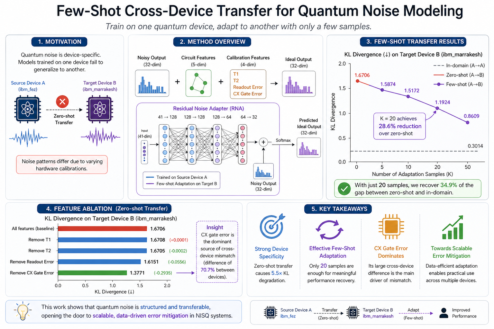

# Few-Shot Cross-Device Transfer for Quantum Noise Modeling on Real Hardware

<p align="center">
  
</p>

<p align="center">
  <a href="https://arxiv.org/abs/2604.24397"></a>
  <a href="https://huggingface.co/datasets/sahilfarib/quantum-noise-transfer"></a>
  
  
  
</p>

> **Sahil Al Farib, Sheikh Redwanul Islam, Azizur Rahman Anik**
>
> *Quantum devices in the NISQ era exhibit hardware-specific noise that limits generalization of learned error-mitigation models across devices. We show that a noise model trained on one IBM quantum device can be adapted to a different device using only 20 calibration samples — achieving a 28.6% KL divergence reduction over zero-shot transfer.*

---

## 📋 Overview

We investigate **few-shot cross-device transfer learning** for quantum noise modeling on real IBM quantum hardware. The key idea: train a residual neural network to map noisy circuit outputs to ideal distributions on a **source device**, then adapt it to a **target device** with minimal data.

### Key Findings

| Condition | KL Divergence ↓ | Improvement |
|:---|:---:|:---:|
| In-domain (A→A) | 0.3014 | — |
| Zero-shot (A→B) | 1.6706 | baseline |
| Few-shot K=5 | 1.5874 ± 0.085 | −5.0% |
| Few-shot K=10 | 1.5172 ± 0.067 | −9.2% |
| **Few-shot K=20** | **1.1924 ± 0.063** | **−28.6%** |

- **5.5× KL degradation** under zero-shot transfer confirms noise is strongly device-specific
- **K=20 fine-tuning** recovers **34.9%** of the gap between zero-shot and in-domain performance
- **CX gate error** is the dominant source of cross-device mismatch (ablation Δ = −0.2935)
- **Readout error** contributes a secondary but consistent mismatch signal (Δ = −0.0556)

---

## 🏗️ Architecture

We design a **Residual Noise Adapter (RNA)** — a lightweight MLP that learns a residual correction over the noisy input distribution:

```
ŷ = softmax( x_noisy + f_θ(x) )
```

```
Input (41-dim) → Linear(128) → LayerNorm → GELU → Dropout(0.1)
              → Linear(128) → LayerNorm → GELU → Dropout(0.1)
              → Linear(64)  → LayerNorm → GELU
              → Linear(32)  [+ residual from noisy distribution]
              → Softmax → Predicted ideal distribution
```

**Input features (41-dim):** 5 circuit structure features + 4 device calibration features (T1, T2, readout error, CX gate error) + 32-dim noisy output distribution.

---

## 📊 Dataset

The dataset is hosted separately on Hugging Face:

🔗 **[sahilfarib/quantum-noise-transfer](https://huggingface.co/datasets/sahilfarib/quantum-noise-transfer)**

### Dataset Summary

| Property | Value |
|:---|:---|
| **Source device** | `ibm_fez` (Backend A) |
| **Target device** | `ibm_marrakesh` (Backend B) |
| **Circuits per device** | 85 |
| **Total samples** | 170 paired (noisy, ideal) distributions |
| **Circuit types** | Random (40), Bell (15), GHZ (15), QFT (15) |
| **Qubit range** | 2–5 qubits |
| **Depth range** | 2–8 |
| **Shots per circuit** | 8,192 |

### Calibration Drift Between Devices

| Property | ibm_fez (A) | ibm_marrakesh (B) | Δ |
|:---|:---:|:---:|:---:|
| T1 (µs) | 142.4 | 192.8 | +35.4% |
| T2 (µs) | 104.1 | 114.0 | +9.6% |
| Readout error | 0.0285 | 0.0335 | +17.5% |
| CX gate error | 0.0328 | 0.0560 | **+70.7%** |

---

## 🔬 Method

### Training (Source Device)

- **Optimizer:** AdamW (lr=1e-3, weight decay=1e-4)
- **Scheduler:** ReduceLROnPlateau (factor=0.5, patience=12)
- **Loss:** KL divergence (`F.kl_div` with `reduction="batchmean"`)
- **Early stopping:** patience=25 on validation KL
- **Best checkpoint:** val KL = 0.4605 at epoch 27 (stopped at epoch 52)

### Few-Shot Adaptation (Target Device)

| Setting | K ≤ 10 | K = 20 |
|:---|:---|:---|
| Trainable layers | Head only | Last hidden block + head |
| Learning rate | 1e-4 | 5e-5 |
| Max epochs | 60 | 80 |
| Replay buffer | 24 Backend A samples | 24 Backend A samples |

Results averaged over **5 random seeds** (seeds 0–4).

---

## 📈 Results

### Feature Ablation

| Ablation | KL Divergence | Δ vs. baseline |
|:---|:---:|:---:|
| All features (baseline) | 1.6706 | — |
| Remove T1 | 1.6708 | +0.0001 |
| Remove T2 | 1.6705 | −0.0002 |
| Remove Readout Error | 1.6151 | −0.0556 |
| **Remove CX Gate Error** | **1.3771** | **−0.2935** |

**CX gate error** introduces the strongest cross-device mismatch — its 70.7% difference between devices causes the source model to misapply its learned error-to-distortion mapping on the target device.

---

## 🔖 Citation

If you use this work, please cite:

```bibtex
@article{farib2026fewshot,
  title={Few-Shot Cross-Device Transfer for Quantum Noise Modeling on Real Hardware},
  author={Farib, Sahil Al and Islam, Sheikh Redwanul and Anik, Azizur Rahman},
  journal={arXiv preprint arXiv:2604.24397},
  year={2026}
}
```

---

## 📄 License

This project is licensed under the MIT License. See [LICENSE](LICENSE) for details.

## 🙏 Acknowledgments

- IBM Quantum services accessed through the IBM Quantum Network
- Circuit execution and calibration data retrieved via the Qiskit IBM Runtime service
- The views expressed are those of the authors and do not reflect the official policy of IBM
